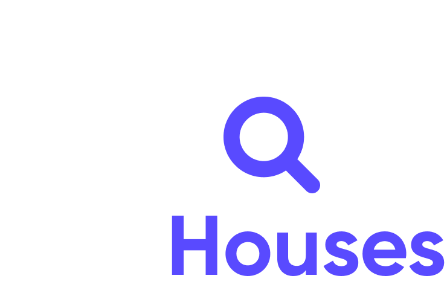

<h1 align="center">
    <a href="https://devriseweek.sevencoders.com.br/" target="_blank">
      
    </a>
</h1>

<h4 align="center">
  🚀 Find Houses
</h4>

<p align="center">
  <a href="#-projeto">Projeto</a>&nbsp;&nbsp;&nbsp;|&nbsp;&nbsp;&nbsp;
  <a href="#-layout">Layout</a>&nbsp;&nbsp;&nbsp;|&nbsp;&nbsp;&nbsp;
  <a href="#rocket-tecnologias">Tecnologias</a>&nbsp;&nbsp;&nbsp;|&nbsp;&nbsp;&nbsp;
  <a href="#rocket-executando">Executando</a>&nbsp;&nbsp;&nbsp;|&nbsp;&nbsp;&nbsp;
  <a href="#memo-licença">Licença</a>
</p>
<br>

## 💻 Projeto

Esse projeto foi desenvolvido durante a DevRise Week promovida pela [SevenApps](http://sevenapps.tech/). Trata-se de um projeto em React Native para aluguel de casas.

## :school_satchel: Aprendizados

- Arquitetura Atomic Design
- Criando componentes com o Storybook
- Estilizando components com o Styled Components
- Instalando dependências com o Yarn
- Consumindo API's com o Axios
- Navegação com o React Navigation
- Gerenciando estado global com o Zustand
- Salvando dados localmente com o Async Storage
- Personalização de Ícones e Splash Screen na camada Nativa
- Gerando versão Release do App
 
## :rocket: Tecnologias

Esse projeto foi desenvolvido com as seguintes tecnologias:

- [styled-components](https://styled-components.com/)

\* Para mais detalhes, veja o **[package.json](./package.json)**

## :notebook: Executando

```bash
# Clone este repositório
$ git clone https://github.com/mauriciofsnts/devriseweek-findhouses.git

# Acesse a pasta do projeto no seu terminal/cmd
$ cd devriseweek-findhouses

# Instale as dependências
$ yarn install

# Execute a aplicação
$ yarn android ou yarn ios
```
---
 
